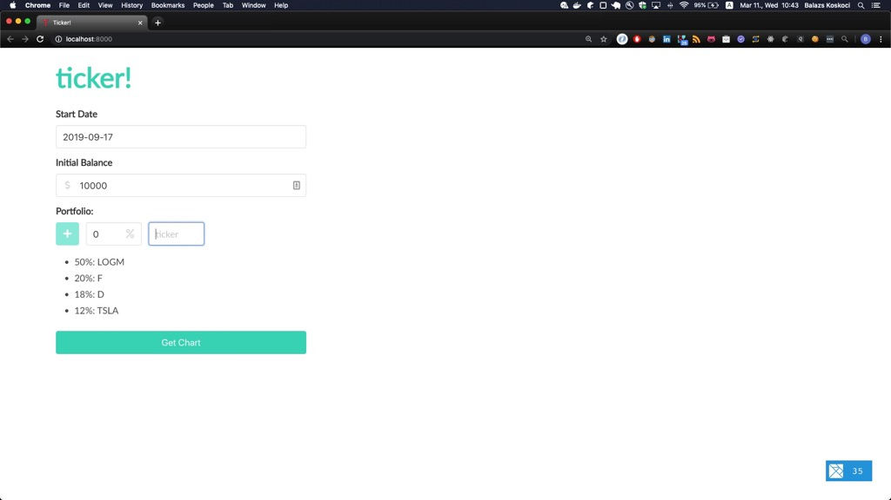
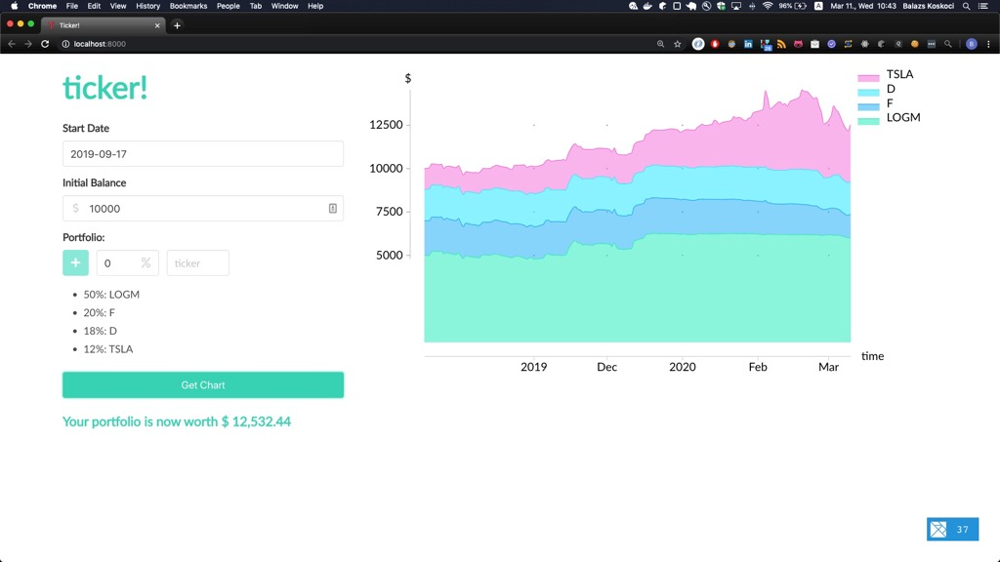

# ticker-fe

First, key in your portfolio details:



Then, click *Get Chart* to get your asset history:



## To start up the frontend:
```bash
elm-live src/Main.elm --open -- --debug --output=elm.js
```
